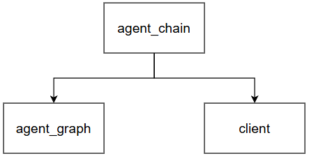

# llminterface

`llminterface` — внутренний слой агента, отвечающий за взаимодействие с языковыми моделями и построение логики передачи 
данных между ними. Также вместо моделей могут быть использованы функции для специфичной обработки данных.

| Подмодуль                                          | Назначение                                                                          |
|----------------------------------------------------|-------------------------------------------------------------------------------------|
| [`client`](#client--работа-с-llm)                  | Единый интерфейс к LLM-провайдерам: сообщения, стриминг, метаданные (токены, время) |
| [`agent_chain`](#agent_chain--конструктор-цепочек) | Создание композиций шагов обработки данных через оператор `\|`                      |
| [`agent_graph`](#agent_graph--граф-движок)         | Граф узлов с условными переходами, параллельным исполнением и общим состоянием      |


В данном модуле не используются сторонние фреймворки специализируемые на общении с LLM &mdash; только `pydantic` и `requests`. 

Подмодуль `agent_chain` может использовать отдельно от остальных подмодулей и позволяет реализовывать простые линейные 
пайплайны, например для обработки данных или обучения ML-моделей.

Подмодуль `agent_chain` может быть использован отдельно от остальных, например для построения пайплайнов обработки 
данных или обучения ML-моделей. `agent_graph` позволяет расширить возможности `agent_chain` с помощью создания графов, а
`client` даёт возможность обращаться к LLM-моделям в узлах цепочки или графа.

Далее на рисунке представлены зависимости подмодулей друг от друга.



Ещё одним важным отличием в работе графов и цепочек является **параллельное исполнение** &mdash; `agent_chain` выполняет 
параллельные подцепочки с помощью их **последовательного выполнения с одинаковым входом**, а `agent_graph` реализует 
настоящее **конкурентное исполнение** паралелльных цепочек. Далее в описаниии подмодулей в обоих случаях
будет использоваться слово "параллельные".

```
llminterface/
├── agent_chain/     # Executable, ExecSequence, ExecParallel, ...
├── agent_graph/      # AgentGraph, AgentState
└── client/           # LLMClient, LLMChat/LLMMessage, providers/OllamaClient
```

---

## `agent_chain` &mdash; конструктор цепочек

Все примитивы этого модуля являются наследниками абстрактного класса `Executable`. 

Идея: любой шаг обработки данных (функция, параллельные ветки, LLM-клиент, другая цепочка) приводится к `Executable` и 
соединяется оператором `|` в последовательность, через которую данные переходят от одного шага к другому.

### `Executable` (`executable.py`)

Базовый абстрактный класс.

```python
class Executable(ABC):
    def run(self, _input=MISSING): ...          # синхронное исполнение
    def stream(self, _input=MISSING): ...        # потоковое исполнение (по умолчанию = run)
    def __call__(self, _input=MISSING): ...      # алиас для run
    def __or__(self, other): ...                 # self | other -> ExecSequence
    def __ror__(self, other): ...                 # other | self -> ExecSequence
```

- `MISSING` — специальный сентинел, означающий "входа нет". Используется, чтобы отличить `run(None)` от вызова без 
аргументов.
- `Executable.to_executable(value)` — приводит произвольное значение к `Executable`; логика приведения зависит от типа
`value`:
  - `Executable` → возвращается как есть;
  - `callable` → оборачивается в `ExecLambda`;
  - `dict` → оборачивается в `ExecParallel`;
  - иначе — `TypeError`.

Благодаря `to_executable` в цепочку можно передавать обычные функции и словари напрямую, не оборачивая их вручную.

### `ExecSequence` — последовательное исполнение

Создаётся автоматически оператором `|`, но можно собрать и явно. `ExecSequence` обладает свойством ассоциативности, так 
как вложенные `ExecSequence` разворачиваются в одну плоскую цепочку &mdash; `(a | b) | c` = `a | (b | c)`.

```python
from agent.llminterface.agent_chain.execs import ExecLambda

chain = ExecLambda(lambda x: x + 1) | ExecLambda(lambda x: x * 2)
chain.run(3)   # -> (3 + 1) * 2 = 8
```

### `ExecParallel` — параллельные ветки

Оборачивает `dict[str, Any]`, каждое значение приводится к `Executable`. При вызове с входом каждая ветка получает **один и тот же вход**, результат — словарь `{ключ: результат_ветки}`.

```python
step = {
    "doubled": lambda d: d * 2,
    "squared": lambda d: d ** 2,
}
# то же самое, что ExecParallel({...}) — {} автоматически приводится через to_executable
result = Executable.to_executable(step).run(4)
# {"doubled": 8, "squared": 16}
```

Для удобства использования можно просто передавать `dict` как элемент цепочки.

### `ExecLambda` — обёртка над функцией

```python
from agent.llminterface.agent_chain.execs import ExecLambda

greet = ExecLambda(lambda name: f"Привет, {name}!")
greet.run("Миша")   # -> "Привет, Миша!"
```

### `ExecPassthrough` — возврат входа без изменений

Возвращает вход без изменений. Может быть полезен при выполнении эффектов без изменения данных, а также для стартового 
элемента цепочки.

```python
from agent.llminterface.agent_chain.execs import ExecPassthrough

ExecPassthrough().run("входные данные")   # -> "входные данные"
```

### `ExecPartial` — частичное применение

Оборачивает `functools.partial(func, *args, **kwargs)` в `Executable`. Повзоляет загрузить в цепочку частично 
применённую функцию, например функция с заданным тэгом для логирования.

```python
from agent.llminterface.agent_chain.execs import ExecPartial

def log(message: str, tag: str) -> str:
    return f"[{tag}] {message}"

step = ExecPartial(log, tag="INFO")
step.run("сервис запущен")   # -> "[INFO] сервис запущен"
```

### `ExecMultiargument` — распаковка входа в аргументы вызова

Принимает функцию или другой `Executable` (`_target`) и распаковывает вход при вызове:
- `dict` → `func(**_input)`;
- `tuple` → `func(*_input)`;
- иначе → `func(_input)`.

Данный примитив позволяет соединить `ExecParallel`-словарь с многоаргументной функцией дальше по цепочке:

```python
from agent.llminterface.agent_chain.execs import ExecMultiargument

def add(a: int, b: int) -> int:
    return a + b

chain = {"a": lambda d: d, "b": lambda d: d * 10} | ExecMultiargument(add)
chain.run(3)   # ExecParallel даёт {"a": 3, "b": 30} -> add(a=3, b=30) -> 33
```

Одно из главных применений `ExecMultiargument` &mdash; встраивание LLMClient в цепочку (будет рассмотренно в 
[`client`](#client--работа-с-llm)):

```python
{"chat": ExecMultiargument(client)}   # -> client.run(chat=..., model=..., tools=..., ...)
```

### `ExecSelect` — переименование ключей словаря

```python
from agent.llminterface.agent_chain.execs import ExecSelect

step = ExecSelect(answer="content", raw="content")
step.run({"content": "52", "other": "x"})   # -> {"answer": "52", "raw": "52"}
```

### `ExecEffect` — побочный эффект без изменения данных

Выполняет вложенный `Executable` ради побочного эффекта (логирование, печать в консоль и т.д.), 
но **возвращает исходный вход без изменений**.

```python
from agent.llminterface.agent_chain.execs import ExecEffect, ExecLambda

step = ExecEffect(ExecLambda(lambda d: print(f"промежуточное значение: {d}")))
chain = ExecLambda(lambda x: x + 1) | step | ExecLambda(lambda x: x * 2)
chain.run(3)   # печатает "промежуточное значение: 4", возвращает 8
```

### `ExecCall` — вызов без учёта входа

Игнорирует пришедший `_input` и просто вызывает `_target` (функцию либо `Executable`) без аргументов.

```python
from agent.llminterface.agent_chain.execs import ExecCall

counter = {"n": 0}
def tick():
    counter["n"] += 1
    return counter["n"]

step = ExecCall(tick)
step.run("входные данные")   # -> 1
```

---

## `agent_graph` — граф-движок

### `AgentState` (`agent_state.py`)

Общее изменяемое состояние, которое передаётся между узлами графа. Хранит значения по ключам и опциональные *reducer*'ы
— функции слияния старого и нового значения по ключу (например, накопление в список вместо перезаписи).

```python
from agent.llminterface.agent_graph.agent_state import AgentState

state = AgentState({"log": []})
state.set_reducer("log", lambda old, new: old + [new])

state.merge({"log": "шаг 1"})
state.merge({"log": "шаг 2"})
state["log"]        # -> ["шаг 1", "шаг 2"]
state.get("missing", "по умолчанию")   # -> "по умолчанию"
```

Без зарегистрированного reducer'а `merge` просто перезаписывает значение по ключу.

### `AgentGraph` (`agent_graph.py`)

Граф узлов `Executable` с направленными рёбрами (статичными и условными) и общим `AgentState`. Наследует `Executable`,
поэтому граф сам может быть узлом другого графа или шагом цепочки.

```python
class AgentGraph(Executable):
    def add_node(self, name: str, node: Any) -> "AgentGraph": ...
    def add_edge(self, src: str, *dst: Any) -> "AgentGraph": ...
    def add_conditional_edge(self, src: str, router: Callable[[AgentState], Any]) -> "AgentGraph": ...
    def set_entry(self, *names: str) -> "AgentGraph": ...
    def run(self, _input=MISSING) -> AgentState: ...
    def stream(self, _input=MISSING) -> AgentState: ...
```

- **Узел** — любой `Executable` (или функция/словарь, приводимые к нему через `to_executable`). Узел получает весь 
`AgentState` и возвращает частичное обновление — `dict`, который сливается в состояние через `AgentState.merge`, либо 
целиком новый `AgentState`.
- **`add_edge(src, *dst)`** — безусловный переход (можно указать несколько `dst` сразу — тогда после `src` параллельно 
запускаются все `dst`).
- **`add_conditional_edge(src, router)`** — `router(state)` возвращает имя следующего узла, список имён (fan-out) или 
`END`. Условное ребро имеет приоритет над статическим для того же узла.
- **`END`** — сентинел конца графа.
- **`set_entry(*names)`** — один или несколько стартовых узлов (запускаются в первом же "супершаге").
- Узлы одного "фронта" (например, несколько целей `add_edge`/fan-out router'а) исполняются **параллельно** через 
`ThreadPoolExecutor`.
- `max_steps` (по умолчанию 1000) — защита от бесконечного цикла между узлами.

Простой пример — счётчик с циклом до условия:

```python
from agent.llminterface.agent_graph.agent_graph import AgentGraph, END
from agent.llminterface.agent_graph.agent_state import AgentState

graph = (
    AgentGraph()
    .add_node("start", lambda s: {"count": 0})
    .add_node("increment", lambda s: {"count": s["count"] + 1})
    .set_entry("start")
    .add_edge("start", "increment")
    .add_conditional_edge("increment", lambda s: "increment" if s["count"] < 5 else END)
)

result = graph.run(AgentState())
result["count"]   # -> 5
```

`run` графа вызывает у узлов `.run()`, `stream` — `.stream()`.

---

## `client` — взаимодействие с LLM

### `LLMChat` / `LLMMessage` / `LLMTokens` / `LLMDuration` (`llm_chat.py`)

`LLMMessage` (pydantic-модель) — одно сообщение диалога с метаданными (роль, содержимое, размышления модели `thinking`, 
запрошенные `tool_calls`, токены, тайминги). `LLMChat` — список сообщений (`UserList`) со встроенной конкатенацией.

```python
from agent.llminterface.client.llm_chat import LLMChat, LLMMessage

chat = LLMChat([{"role": "user", "content": "Сколько будет 2+2?"}])
chat += LLMMessage.from_message({"role": "assistant", "content": "4"})

chat.to_payload()
# [{"role": "user", "content": "Сколько будет 2+2?"},
#  {"role": "assistant", "content": "4"}]
```

Реализованные фабрики:
- `LLMMessage.from_response(response: dict, provider: str)` — разобрать сырой ответ провайдера (токены, длительности, 
`tool_calls`) в `LLMMessage`;
- `LLMMessage.from_message(message: dict)` — обернуть простое `{"role", "content"}` в `LLMMessage`;
- `LLMMessage.tool_result(name, content)` — собрать сообщение роли `"tool"` с результатом выполнения инструмента.

`LLMTokens.total` и `LLMDuration.total` — суммарные токены/наносекунды (`prompt + response`, у `LLMDuration` ещё `+ load`).

### `LLMClient` (`llm_client.py`)

Абстрактный класс провайдера. Наследует `Executable`, поэтому клиент может использоваться как узел графа/цепочки.

```python
class LLMClient(Executable):
    def send(self, chat: LLMChat, **kwargs) -> LLMChat: ...     # синхронный вызов
    def stream(self, chat: LLMChat, on_chunk_think=None,
               on_chunk_content=None, **kwargs) -> LLMChat: ... # потоковый вызов с колбэками на чанк
    def run(self, *args, **kwargs):
        return self.send(*args, **kwargs)
```

Любая новая интеграция (OpenAI, Anthropic и т.д.) реализуется одним классом-наследником с методами `send` и `stream`.

### `OllamaClient` (`providers/ollama_client.py`)

Единственная реализация `LLMClient` на данный момент — клиент для локального Ollama-сервера.

```python
from agent.llminterface.client.providers.ollama_client import OllamaClient
from agent.llminterface.client.llm_chat import LLMChat

client = OllamaClient(
    url="http://localhost:11434/api/chat",
    timeout=600,
    temperature=0.7,       # попадёт в payload["options"] (параметр модели)
)

chat = LLMChat([{"role": "user", "content": "Привет!"}])

# синхронный вызов
chat = client.send(chat, model="qwen3:8b")
print(chat[-1].content)

# потоковый вызов с колбэками на каждый чанк
def on_content(chunk: str) -> None:
    print(chunk, end="", flush=True)

chat = client.stream(chat, model="qwen3:8b", on_chunk_content=on_content)
```

Параметры конструктора и вызовов автоматически разносятся между телом запроса Ollama 
(`model`, `messages`, `stream`, `format`, `keep_alive`, `tools`) и `payload["options"]` 
(все остальные — температура, top_p и т.д.). Также при запросе к моделе можно временно изменить уже заданный при 
инициализации параметр на необходимый.

---

## Пример: цепочка + граф + клиент

```python
from agent.llminterface.agent_chain.execs import ExecMultiargument
from agent.llminterface.agent_graph.agent_graph import AgentGraph, END
from agent.llminterface.agent_graph.agent_state import AgentState
from agent.llminterface.client.llm_chat import LLMChat
from agent.llminterface.client.providers.ollama_client import OllamaClient

client = OllamaClient(url="http://localhost:11434/api/chat")

# Executable-цепочка: собрать вход для клиента -> вызвать модель -> достать текст ответа
chain = (
    {
        "chat": lambda d: d["chat"],
        "model": lambda d: d["model"],
    }
    | {"chat": ExecMultiargument(client)}
    | {"chat": lambda d: d["chat"], "answer": lambda d: d["chat"][-1].content}
)

graph = (
    AgentGraph()
    .add_node("start", lambda s: {})
    .add_node("model", chain)
    .set_entry("start")
    .add_edge("start", "model")
    .add_edge("model", END)
)

state = AgentState({
    "chat": LLMChat([{"role": "user", "content": "Расскажи анекдот"}]),
    "model": "qwen3:8b",
})

result = graph.run(state)
print(result["answer"])
```

---

## Установка

Зависимости модуля перечислены в [`requirements/agent.txt`](../requirements/agent.txt) (`requests`, `pydantic`, `rich`); `beautifulsoup4` и `playwright` нужны только инструментам в `agent/tools`, а не самому `llminterface`.

## Ограничения

- `AgentGraph` исполняет узлы одного фронта параллельно через потоки, но `AgentState.merge` не синхронизирован — при параллельных ветках, пишущих в один и тот же ключ без reducer'а, возможна гонка. Используйте `set_reducer` для ключей, в которые пишут несколько узлов одновременно.
- `OllamaClient` — единственный провайдер; `LLMClient` спроектирован как расширяемый интерфейс, другие реализации могут быть добавлены позже
